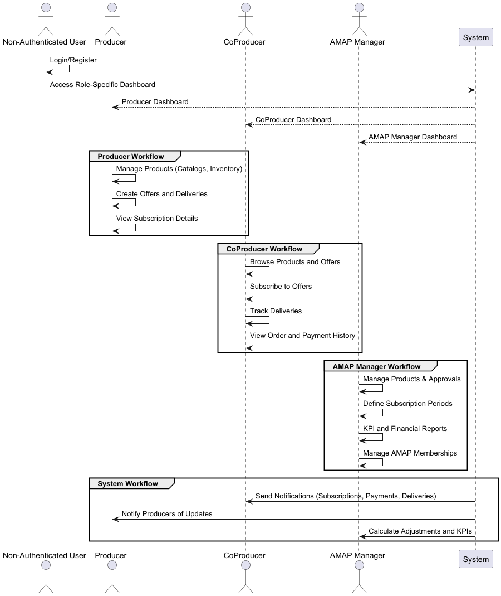

# Story Mapping - General View

This table outlines a first iteration this Sprint's story mapping in order to complete the eight epics as well as the project backbone.

The project will defacto starts in November 17th, 2024 which leaves three weeks to complete the sprint. As such, the plan includes three releases.

## Week 0: Preparation

During Week 0, the team outlined the project's high-level plan, including the technologies to be used. They agreed to:

* Collaborate on backbone tasks.
* Divide epics among team members based on their work on the initial SRS report.
* Interpret epics and add essential features to ensure the application meets all requirements.

<table>
  <thead>
    <tr>
      <th>Aspect</th>
      <th>Details</th>
    </tr>
  </thead>
  <tbody>
    <tr>
      <td>Technology</td>
      <td>
        <ul>
          <li><b>Frontend:</b> .NET MVC for UI and role-based views.</li>
          <li><b>Backend:</b> .NET Core for APIs and business logic.</li>
          <li><b>Database:</b> MySQL for relational data like product catalogs, offers, and subscriptions.</li>
          <li><b>Notifications:</b> Email service (e.g., SendGrid) and in-app notifications.</li>
        </ul>
      </td>
    </tr>
    <tr>
      <td>Data Flow</td>
      <td>
        <ul>
          <li>Producers define products.</li>
          <li>AMAP managers set subscription periods.</li>
          <li>Producers create offers within defined periods.</li>
          <li>CoProducers subscribe to offers.</li>
          <li>Deliveries are made and updated.</li>
          <li>Adjustments and KPIs are calculated for reporting.</li>
        </ul>
      </td>
    </tr>
    <tr>
      <td>Environment Setup</td>
      <td>
        <ul>
          <li>Setup development environments for frontend and backend teams.</li>
          <li>Initialize the MySQL database schema for core entities (e.g., Users, Products, Offers).</li>
          <li>Configure email notification services (e.g., SendGrid API).</li>
          <li>Implement basic CI/CD pipelines for deployments.</li>
        </ul>
      </td>
    </tr>
    <tr>
      <td>Architecture</td>
      <td>
        <ul>
          <li>Adopt a modular architecture for separating concerns (UI, APIs, business logic).</li>
          <li>Follow RESTful principles for API design.</li>
          <li>Ensure scalability to support multiple AMAPs on a shared platform.</li>
        </ul>
      </td>
    </tr>
  </tbody>
</table>

## System Workflow Overview

The following storyboarding diagram provides a clear visualization of the system's workflow, showcasing the interactions between different actors and their responsibilities within the application.

## Release 1: Walking Skeleton

<table>
  <thead>
    <tr>
      <th>Epic</th>
      <th>Actor(s)</th>
      <th>User Story</th>
      <th>Tasks</th>
      <th>Responsible Developer</th>
      <th>Tasks Completed</th>
      <th>Tasks Transitioning</th>
    </tr>
  </thead>
  <tbody>
    <tr>
      <td>Account Management</td>
      <td>Non-Authenticated User</td>
      <td>Basic Registration and Login</td>
      <td>
        <ul>
          <li>Register new accounts with roles (Producer, CoProducer).</li>
          <li>Login using app credentials or IAM.</li>
          <li>Access public information without logging in.</li>
        </ul>
      </td>
      <td></td>
      <td></td>
      <td></td>
    </tr>
    <tr>
      <td>Product Management</td>
      <td>Producers</td>
      <td>Create Basic Product Catalog</td>
      <td>
        <ul>
          <li>Add product names, descriptions, prices, and images.</li>
          <li>Edit existing product details.</li>
        </ul>
      </td>
      <td></td>
      <td></td>
      <td></td>
    </tr>
    <tr>
      <td>Subscription Management</td>
      <td>AMAP Managers</td>
      <td>Define Subscription Periods</td>
      <td>
        <ul>
          <li>Set subscription period start and end dates.</li>
          <li>Notify Producers about subscription periods.</li>
        </ul>
      </td>
      <td></td>
      <td></td>
      <td></td>
    </tr>
    <tr>
      <td>Delivery Management</td>
      <td>CoProducers</td>
      <td>View Delivery Schedules</td>
      <td>
        <ul>
          <li>Access a calendar of upcoming deliveries.</li>
        </ul>
      </td>
      <td></td>
      <td></td>
      <td></td>
    </tr>
    <tr>
      <td>System Notifications</td>
      <td>System</td>
      <td>Basic Notifications</td>
      <td>
        <ul>
          <li>Notify users of successful subscriptions.</li>
          <li>Remind CoProducers of upcoming deliveries.</li>
        </ul>
      </td>
      <td></td>
      <td></td>
      <td></td>
    </tr>
  </tbody>
</table>

## Release 2: Core Functionality

<table>
  <thead>
    <tr>
      <th>Epic</th>
      <th>Actor(s)</th>
      <th>User Story</th>
      <th>Tasks</th>
      <th>Responsible Developer</th>
      <th>Tasks Completed</th>
      <th>Tasks Transitioning</th>
    </tr>
  </thead>
  <tbody>
    <tr>
      <td>Subscription Management</td>
      <td>CoProducers</td>
      <td>Enhanced Subscription Workflows</td>
      <td>
        <ul>
          <li>Allow CoProducers to modify or cancel subscriptions.</li>
          <li>Filter offers by product type or producer.</li>
        </ul>
      </td>
      <td></td>
      <td></td>
      <td></td>
    </tr>
    <tr>
      <td>Financial Management</td>
      <td>System</td>
      <td>Payment Tracking and Notifications</td>
      <td>
        <ul>
          <li>Track pending and completed payments.</li>
          <li>Send payment reminders to CoProducers.</li>
        </ul>
      </td>
      <td></td>
      <td></td>
      <td></td>
    </tr>
    <tr>
      <td>Delivery Management</td>
      <td>Producers</td>
      <td>Adjust Deliveries</td>
      <td>
        <ul>
          <li>Allow Producers to confirm and adjust delivered quantities.</li>
          <li>Update balances based on delivery changes.</li>
        </ul>
      </td>
      <td></td>
      <td></td>
      <td></td>
    </tr>
    <tr>
      <td>Product Management</td>
      <td>Producers</td>
      <td>Collaborative Product Offers</td>
      <td>
        <ul>
          <li>Create shared offers across multiple Producers.</li>
          <li>Allow AMAP Managers to approve collaborative offers.</li>
        </ul>
      </td>
      <td></td>
      <td></td>
      <td></td>
    </tr>
  </tbody>
</table>

## Release 3: Advanced Features

<table>
  <thead>
    <tr>
      <th>Epic</th>
      <th>Actor(s)</th>
      <th>User Story</th>
      <th>Tasks</th>
      <th>Responsible Developer</th>
      <th>Tasks Completed</th>
      <th>Tasks Transitioning</th>
    </tr>
  </thead>
  <tbody>
    <tr>
      <td>AMAP Management</td>
      <td>AMAP Managers</td>
      <td>Membership Handling</td>
      <td>
        <ul>
          <li>Approve or reject membership requests.</li>
          <li>Manage role assignments and permissions.</li>
        </ul>
      </td>
      <td></td>
      <td></td>
      <td></td>
    </tr>
    <tr>
      <td>Reporting & Insights</td>
      <td>AMAP Managers</td>
      <td>Advanced Reporting</td>
      <td>
        <ul>
          <li>Generate KPI dashboards for subscription and delivery performance.</li>
          <li>Provide CoProducers with personalized subscription summaries.</li>
        </ul>
      </td>
      <td></td>
      <td></td>
      <td></td>
    </tr>
    <tr>
      <td>System Notifications</td>
      <td>System</td>
      <td>Detailed Notifications</td>
      <td>
        <ul>
          <li>Notify users of payment discrepancies.</li>
          <li>Send reminders for subscription modifications before deadlines.</li>
        </ul>
      </td>
      <td></td>
      <td></td>
      <td></td>
    </tr>
  </tbody>
</table>
